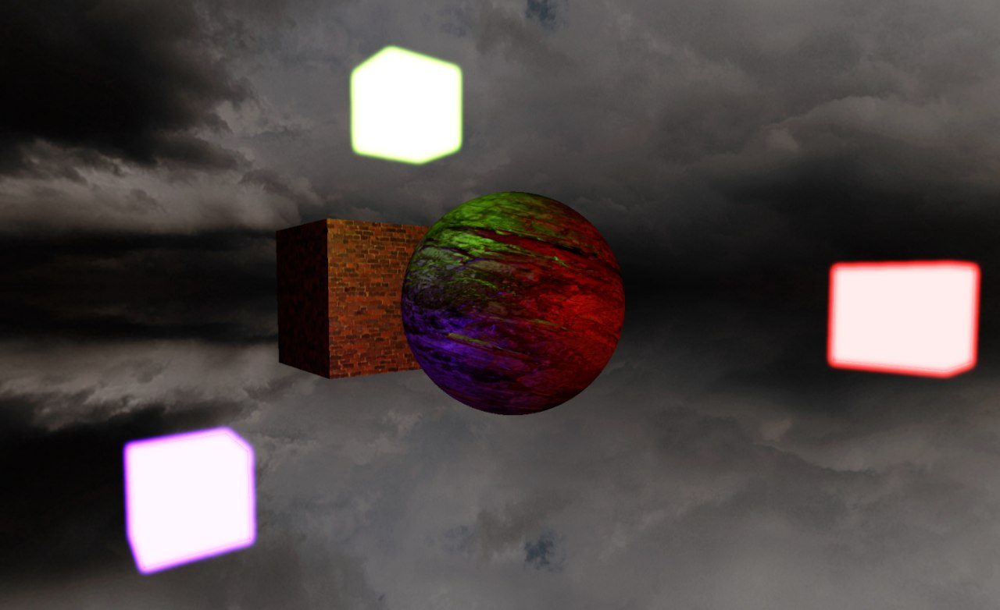
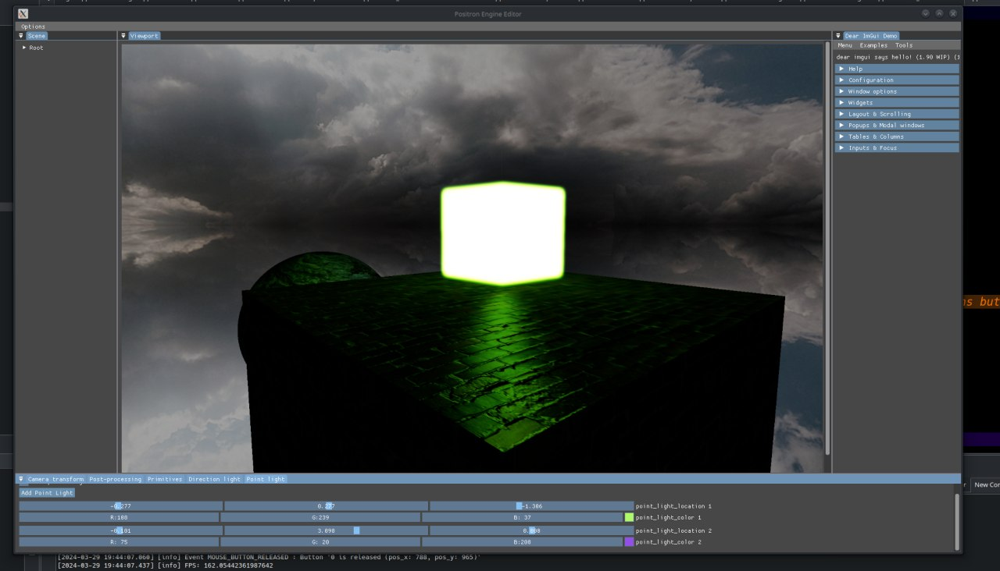
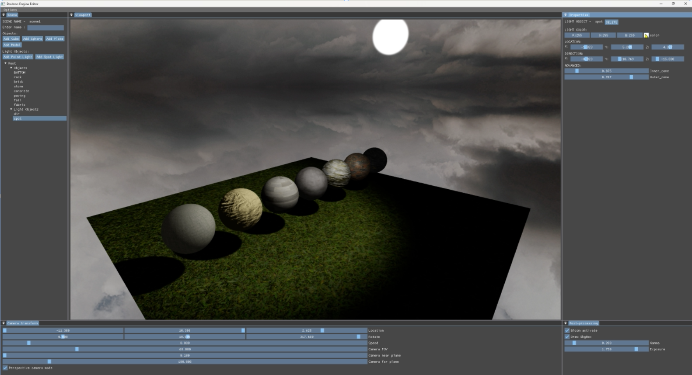
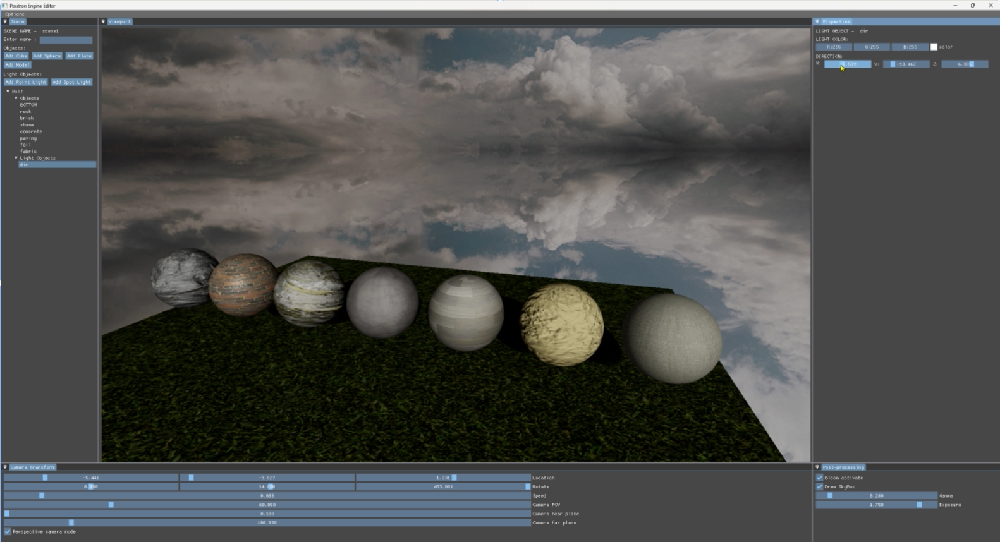
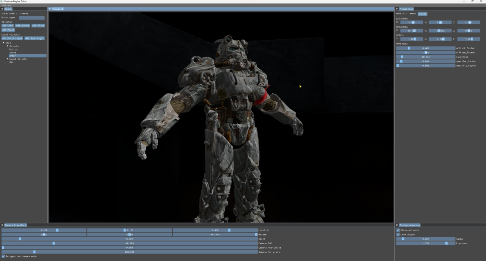

# PositronEngine
This OpenGL-based graphics engine is my graduation project at BNTU. I wrote it myself using popular libraries such as GLFW, GLAD, GLM, assimp, ImGUI. 

Thanks to this project I have learned a lot of technical material and realized how to build graphics in real time. This is not the final look of the graphics engine but I hope to get it up and running someday.

**Check the vedio of demo of PositronEngine  -  **
**Multiple lighting sources**

**Texture maps**

**Support for different materials**

**3D models support**

**To run the application you need to execute the bash script that is in the project. To do this, enter the command *bash start_up.sh* in the terminal. After the project is built, the application will be launched automatically (script works only for Linux).**

